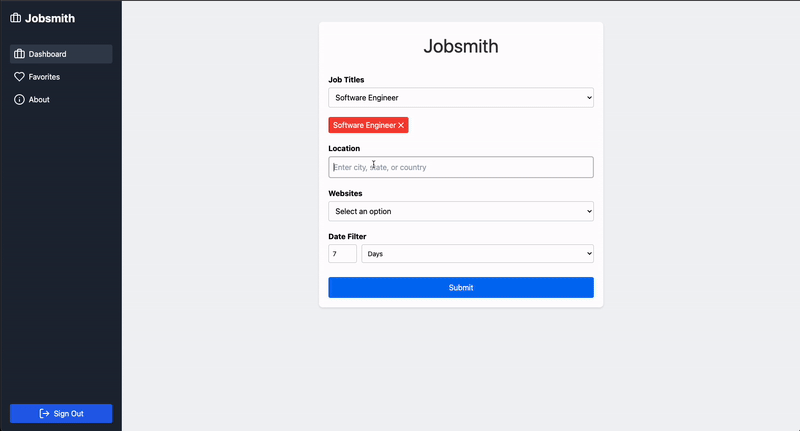
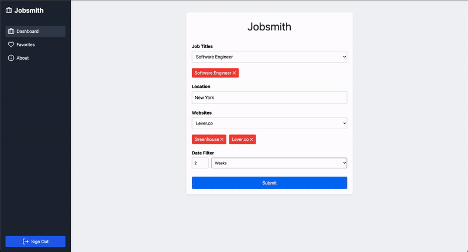

<div align="center">


[](https://www.javascript.com/)
[](https://reactjs.org/)
[](https://developer.mozilla.org/en-US/docs/Web/HTML)
[](https://tailwindcss.com/)
[](https://nodejs.org/)
[](https://www.postgresql.org/)
[](https://github.com/oslabs-beta/Morpheus)
[](https://jestjs.io/)
[](https://shadcn.dev/)

---

<p align="center" style="font-size: 1em">
<a name="website" href="">Website</a>
<a name="medium" href="">Medium</a>
</p>

---
Search for Jobs
---



---
Favorite Jobs
---




---
## Project Setup

This project requires several environment variables to be configured for proper functionality. Below is a guide to setting up the `.env` file with the necessary parameters.

### Steps to Set Up

#### Clone the Repository
Clone the project repository to your local machine:

```bash
git clone <repository-url>
cd <repository-folder>
```

#### Create a `.env` File
In the root of the project, create a `.env` file by running:

```bash
touch .env
```

#### Add Environment Variables
Open the `.env` file in your preferred text editor and add the following environment variables. Leave the values blank for sensitive information like API keys, except for `SEARCH_ENGINE_ID`, which is pre-populated

You are welcome to use any other search engine ID you find, the one pre-populated is curated for best performance or create your own [Here](https://developers.google.com/custom-search):


You can source the GOOGLE_API_KEY [ Here](https://developers.google.com/custom-search/v1/overview). Click on the  `Get Key` button

```bash
GOOGLE_API_KEY=
SEARCH_ENGINE_ID="15975b5c726334069"
PORT=3000
SUPABASE_URL=
SUPABASE_KEY=
DATABASE_URL=
JWT_SECRET=
```

### Description of Variables:

- `GOOGLE_API_KEY`: Your Google API Key. Required for accessing Google services.
- `SEARCH_ENGINE_ID`: The search engine ID. Pre-populated, but you may change it if needed.
- `PORT`: The port on which your app will run (default is 3000).
- `SUPABASE_URL`: The URL for your Supabase instance.
- `SUPABASE_KEY`: Your Supabase API key for connecting to the database.
- `DATABASE_URL`: The URL of your PostgreSQL database, which includes credentials.
- `JWT_SECRET`: A secret key for signing JWT tokens.

### Install Dependencies
Install the required dependencies by running:

```bash
npm install
```

### Run the Project
Start the development server by running:

```bash
npm run dev
```

The app will run on the port specified in the `.env` file (`3000` by default).

---

Now your environment should be properly configured for development. Don't forget to securely store your sensitive keys and secrets!
</p>
</div>
